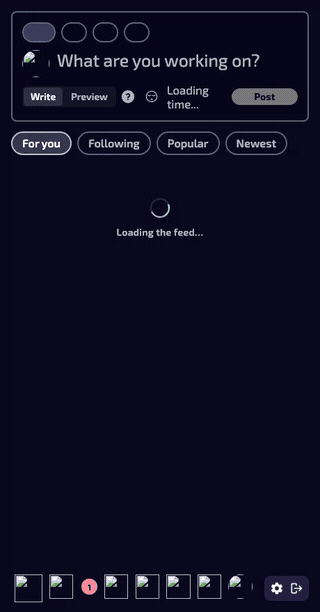

# Feed performance: benchmark, findings, and fixes

This documents a data-driven pass over the main Stardance user flows (feed,
scrolling, liking, commenting), the performance problems found, and the fixes
applied in this PR.

## Method

- **Data:** a mirror of the production database (≈30k users, 14.4k posts, 12.2k
  devlogs, 24.7k projects) restored locally, so query plans and association
  fan-out match real-world cardinality rather than a handful of fixtures.
- **User:** signed in as the most active account (147 posts) so the feed is fully
  populated and worst-case for per-item work.
- **Measurement:** each endpoint hit 6× warm; numbers are the **median** of the
  Rails `Completed … (Views | ActiveRecord | N queries)` log line. Query call
  sites were attributed via `ActiveRecord` backtrace logging (`↳ file:line`).

All timings are local (DB round-trips ≈0.5 ms). The **query-count** reductions
are the headline: in production each eliminated query is a network round-trip to
the database, so the wall-clock win there is proportionally larger than shown.

## Flows benchmarked

| Flow | Route | Notes |
|------|-------|-------|
| Feed — "For you" (page 1) | `GET /home/feed` | Default tab; Gorse recs + SQL backfill, 20 posts |
| Feed — scroll (page 2) | `GET /home/feed?page=2` | Lazy Turbo-Frame pagination fires this per page |
| Like / unlike | `POST/DELETE /devlogs/:id/like` | `counter_cache` + single Turbo Stream partial |
| Comment | `POST /devlogs/:id/comments` | `counter_cache` + single Turbo Stream partial |

Like and comment are already cheap: both are backed by `counter_cache` columns
(`likes_count`, `comments_count`) and render one Turbo Stream partial, so they do
no per-feed-item work. The feed render is where the cost — and the bugs — were.

## Problems found

The feed render fired **61 SQL queries** for 20 posts. Two of them were N+1s
hiding behind an otherwise-correct preload pass (`preload_feed_associations`):

### 1. Per-card author lookup in `Post::DevlogPolicy#owns?` — ~15 queries

The card component asks `policy(devlog).edit?`/`.destroy?` for every devlog to
decide whether to show the edit/delete controls. `owns?` compared
`post.user == user`, which **loads each post's author** even though the policy
only needs identity:

```
User Load  SELECT "users".* FROM "users" WHERE "users"."id" = 16316 LIMIT 1
  ↳ app/policies/post/devlog_policy.rb:42
... (repeated once per card)
```

**Fix:** compare foreign keys instead of materializing the association —
`post.user_id == user.id`. Zero queries, identical result.

### 2. Per-post `postable` load in `Home::FeedsController#compose_feed` — 20 queries

`compose_feed` iterates the SQL backfill and calls `post.postable.present?` on
each candidate to filter out orphaned/invisible posts. Because this ran *before*
`preload_feed_associations`, it loaded each devlog one row at a time:

```
Post::Devlog Load  SELECT … FROM "post_devlogs" WHERE … "id" = 1 LIMIT 1
  ↳ app/controllers/home/feeds_controller.rb:121
... (repeated once per candidate)
```

**Fix:** materialize the backfill and `preload(backfill_posts, :postable)` once
before the filter loop. The later deep preload descends from the already-loaded
postables, so nothing is loaded twice.

### Query attribution — before vs after (feed page 1)

| Call site | Before | After |
|-----------|-------:|------:|
| `devlog_policy.rb:42` (`owns?` author load) | ~15 | **0** |
| `compose_feed` postable load | 20 | **1** (batched) |
| everything else (feed CTE, preloads, likes/reposts, flipper, shelf) | ~26 | ~20 |
| **total** | **61** | **21** |

## Results

| Flow | Before (median) | After (median) | Δ |
|------|----------------:|---------------:|---|
| Feed page 1 — total | 288 ms | **184 ms** | **−36 %** |
| Feed page 1 — queries | 61 | **21** | **−66 %** |
| Feed page 2 (scroll) — total | 195 ms | **142 ms** | **−27 %** |
| Feed page 2 (scroll) — queries | 56 | **16** | **−71 %** |

Because infinite scroll re-runs the feed query per page, the per-page query
savings compound across a scrolling session.

### Before / after

Same flow (load feed → scroll), recorded against the prod mirror. Post media is
intentionally not loaded (only DB rows were mirrored, not blob files) so the clip
reflects server-render time, not image download.

| Before | After |
|--------|-------|
|  |  |

## Further opportunities (not in this PR)

Documented for follow-up; left out here to keep the change small and
migration-free:

- **Recommended-projects shelf** (`Feed::ShelfComponent` →
  `recommendable_scope.with_banner_priority`) is the slowest *single* query
  (~25 ms): a `NOT IN (subquery)` + Active Storage join + `ORDER BY
  attachments.id IS NULL`. A partial index / rewrite would help.
- **Feed ranking CTE** (`Gorse::PostPayload.feed_scope`) is ~52 ms — the
  irreducible core query; worth an index review on the `quality_latest` ordering
  columns.
